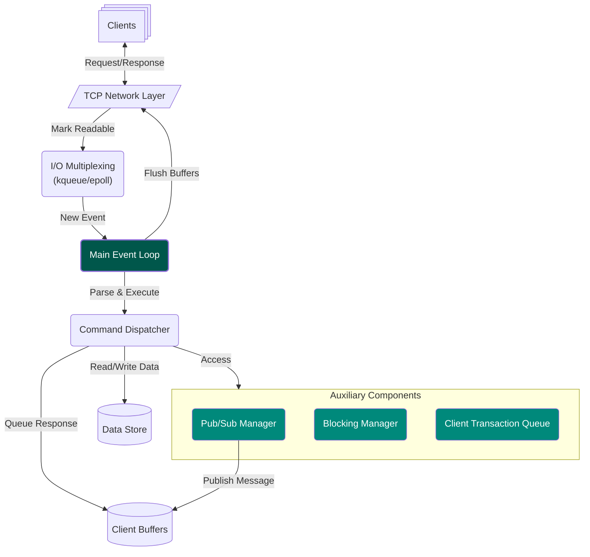

# Redis

[](https://redis.ziheng.dev/)

> ... but homebrewed (and _slightly_ more fragile) in C++.

A project focused on emulating Redis’s high efficiency and performance, utilizing a single-threaded, event-driven architecture with I/O multiplexing (kqueue/epoll) to support concurrent client connections and blocking operations.



## ✨ Features

> If you squint, it’s almost Redis.

### Commands That (Probably) Work

#### Strings
> No frills, just vibes.
* `GET`
* `SET`

#### Lists
> Engineered for O(1) at the ends. Engineered for O(¯\\(ツ)/¯) in the middle.
* `LPUSH`
* `RPUSH`
* `LPOP`
* `LLEN`
* `LRANGE`
* `BLPOP`

#### Streams
> Wait, Redis can do that?
* `XADD`
* `XRANGE`
* `XREAD`

#### Pub/Sub
> I also homebrewed Kafka.
* `SUBSCRIBE`
* `UNSUBSCRIBE`
* `PUBLISH`

#### Transactions
> For rollback, please consult your nearest relational database.
* `MULTI`
* `EXEC`
* `DISCARD`

## 🚧 Setup

> The part everyone skips anyway.

```bash
# 1. Install vcpkg
git clone https://github.com/microsoft/vcpkg.git
cd vcpkg && ./bootstrap-vcpkg.sh

export VCPKG_ROOT=/path/to/vcpkg
export PATH=$VCPKG_ROOT:$PATH

# 2. Start server
./run.sh

# 3. Connect client
redis-cli -h localhost -p 6379
```

> Yes, I am reinventing the wheel. But at least it’s not in JavaScript.


